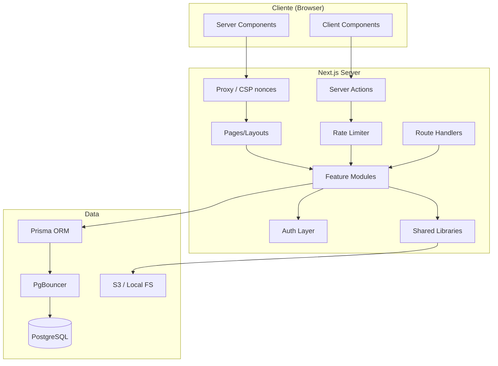

# COMUNET — Arquitectura

## Stack Tecnológico

| Capa | Tecnología |
|------|-----------|
| Framework | Next.js 16 App Router (Turbopack) |
| Lenguaje | TypeScript |
| Package Manager | pnpm |
| CSS | Tailwind CSS 4 |
| Componentes UI | shadcn/ui + Lucide Icons |
| Gráficos | Recharts (lazy-loaded via `next/dynamic`) |
| ORM | Prisma 6 |
| Base de datos | PostgreSQL 16 (Docker Compose + PgBouncer en prod) |
| Validación | Zod |
| Formularios | React Hook Form |
| Tablas | TanStack Table |
| Rate Limiting | @upstash/ratelimit (Redis) + in-memory fallback |
| Storage | Local adapter (dev) + S3-compatible adapter (prod) |
| Testing unitario | Vitest |
| Testing E2E | Playwright |
| Testing carga | k6 |
| Autenticación | Custom (bcrypt + cookies HTTP-only firmadas con HMAC-SHA256) |

## Arquitectura General

Monolito modular orientado a features (vertical slices).



## Estructura de Directorios

```
/docs                          # Documentación técnica
/prisma
  schema.prisma               # Modelo de datos
  seed.ts                     # Datos demo
/tests
  /e2e                        # Tests Playwright
  /load                       # Tests k6 (load-test.js)
/src
  /app
    /(public)/login            # Login
    /(backoffice)/...          # Rutas backoffice
      loading.tsx              # Skeleton loading (streaming)
      error.tsx                # Error boundary con reintento
      not-found.tsx            # 404 contextualizado
      dashboard/
        loading.tsx            # Skeleton específico dashboard
        page.tsx               # Dashboard con Suspense streaming
        dashboard-charts.tsx   # Recharts lazy-loaded (ssr:false)
    /(portal)/portal/...       # Rutas portales
      loading.tsx              # Skeleton loading portal
      error.tsx                # Error boundary portal
      not-found.tsx            # 404 contextualizado portal
    global-error.tsx           # Error boundary global (layout raíz)
    not-found.tsx              # 404 global
    /api/...                   # Route handlers
      /health                  # Liveness + readiness probes
  /components
    /ui                        # shadcn/ui + charts.tsx
    /shared                    # Componentes compartidos
    /layouts                   # Sidebars, headers
  /modules
    /<feature>/
      components/              # Componentes del módulo
      server/
        queries.ts             # Lecturas (con requireAuth + requirePermission)
        actions.ts             # Mutaciones (Server Actions)
        services.ts            # Lógica de negocio
        repository.ts          # Acceso a datos (select: optimizado)
      schemas.ts               # Schemas Zod
      permissions.ts           # Permisos del módulo
      types.ts                 # Tipos
  /lib
    /db                        # Cliente Prisma (singleton + pool config)
    /auth                      # Auth helpers (JWT, session, guards)
    /permissions               # Sistema de permisos (memoizado)
    /formatters                # Formateo (fechas, moneda)
    /storage                   # Abstracción async (local + S3)
    /utils                     # Utilidades
    /validators                # Validadores comunes
    rate-limit.ts              # Rate limiter (Upstash/in-memory)
  /types                       # Tipos globales
```

## Patrones Next.js

| Patrón | Uso |
|--------|-----|
| Server Components | Páginas, layouts, listados, detalles |
| Client Components | Formularios interactivos, tablas, gráficos (lazy) |
| Server Actions | Todas las mutaciones desde formularios |
| Route Handlers | Exports CSV, downloads, healthcheck, webhooks |
| `next/dynamic` | Recharts (ssr: false), componentes pesados |
| Suspense streaming | Dashboard (KPIs inmediatos, datos por streaming) |
| `loading.tsx` | Skeleton de cada route group |
| `error.tsx` | Error boundary con opción de reintento |
| `not-found.tsx` | 404 contextualizados por zona |

### Server Actions — Flujo obligatorio
1. `"use server"`
2. Validar input con Zod
3. Validar sesión (`requireAuth()`)
4. Validar permisos (`requirePermission()`)
5. Ejecutar servicio
6. Registrar auditoría (fire-and-forget)
7. Revalidar ruta/cache

## Multi-tenancy

- **Office** es el tenant principal.
- Toda query filtra por `officeId`.
- Si una entidad no tiene `officeId` directo, se filtra vía `community.officeId`.
- Validación de alcance en servidor (pages, layouts, queries, actions).
- No se confía solo en proxy/middleware.

## Optimizaciones de Rendimiento

| Optimización | Impacto |
|-------------|---------|
| Recharts lazy-loaded (`next/dynamic`, `ssr: false`) | ~500KB menos en first paint |
| Dashboard Suspense streaming | KPIs instantáneos, datos pesados por streaming |
| Prisma `select:` en listados y detalles | Transferencia DB reducida (solo campos necesarios) |
| Audit log fire-and-forget | INSERT asíncrono fuera del path crítico |
| Notificaciones batch | N inserts → 1 INSERT bulk |
| PgBouncer connection pooling | Multiplexado de conexiones DB |
| Permissions memoizadas | Sin queries DB redundantes en guards |

## Decisiones Técnicas y Trade-offs

| Decisión | Razón |
|----------|-------|
| Auth custom vs Auth.js | Evitar fricción de versiones; API estable con `getCurrentSession()`, `requireAuth()`, etc. |
| Monolito modular vs microservicios | Simplicidad, un solo deploy, sin overhead de red |
| Decimal para dinero | Evitar errores de punto flotante |
| Soft-delete con archivedAt | Preservar integridad referencial |
| S3 adapter + local fallback | Funcional en dev sin deps externas; escalable en prod |
| Vertical slices | Cada feature es independiente y completa |
| Rate limiter dual | In-memory para dev/single-instance; Upstash para prod/multi-instance |
| CSP con nonces | Elimina `unsafe-inline`, seguridad de producción real |
| Suspense streaming | Perceived performance: contenido crítico al instante |
