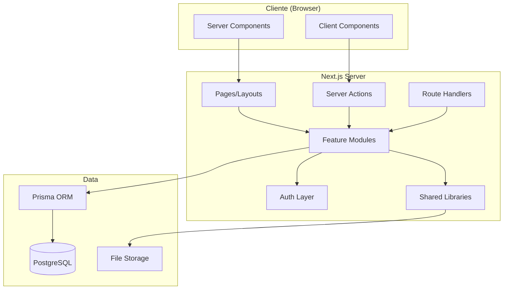

# COMUNET — Arquitectura

## Stack Tecnológico

| Capa | Tecnología |
|------|-----------|
| Framework | Next.js 15 App Router |
| Lenguaje | TypeScript |
| Package Manager | pnpm |
| CSS | Tailwind CSS |
| Componentes UI | shadcn/ui |
| ORM | Prisma |
| Base de datos | PostgreSQL (Docker Compose) |
| Validación | Zod |
| Formularios | React Hook Form |
| Tablas | TanStack Table |
| Testing unitario | Vitest |
| Testing E2E | Playwright |
| Autenticación | Custom (bcrypt + cookies HTTP-only firmadas) |

## Arquitectura General

Monolito modular orientado a features (vertical slices).



## Estructura de Directorios

```
/docs                          # Documentación
/prisma
  schema.prisma               # Modelo de datos
  seed.ts                     # Datos demo
/src
  /app
    /(public)/login            # Login
    /(backoffice)/...          # Rutas backoffice
    /(portal)/portal/...       # Rutas portales
    /api/...                   # Route handlers
  /components
    /ui                        # shadcn/ui components
    /shared                    # Componentes compartidos
    /layouts                   # Layouts
  /modules
    /<feature>/
      components/              # Componentes del módulo
      server/
        queries.ts             # Lecturas
        actions.ts             # Mutaciones (Server Actions)
        services.ts            # Lógica de negocio
        repository.ts          # Acceso a datos
      schemas.ts               # Schemas Zod
      permissions.ts           # Permisos del módulo
      types.ts                 # Tipos
  /lib
    /db                        # Cliente Prisma
    /auth                      # Auth helpers
    /permissions               # Sistema de permisos
    /formatters                # Formateo (fechas, moneda)
    /storage                   # Abstracción de storage
    /utils                     # Utilidades
    /validators                # Validadores comunes
  /types                       # Tipos globales
/tests/e2e                     # Tests E2E
```

## Patrones Next.js

| Patrón | Uso |
|--------|-----|
| Server Components | Páginas, layouts, listados, detalles |
| Client Components | Formularios interactivos, tablas avanzadas, estados de UI |
| Server Actions | Todas las mutaciones desde formularios |
| Route Handlers | Exports CSV, downloads, healthcheck, webhooks, mocks |

### Server Actions — Flujo obligatorio
1. `"use server"`
2. Validar input con Zod
3. Validar sesión (`requireAuth()`)
4. Validar permisos (`requirePermission()`)
5. Ejecutar servicio
6. Registrar auditoría
7. Revalidar ruta/cache

## Multi-tenancy

- **Office** es el tenant principal.
- Toda query filtra por `officeId`.
- Si una entidad no tiene `officeId` directo, se filtra vía `community.officeId`.
- Validación de alcance en servidor (pages, layouts, queries, actions).
- No se confía solo en middleware.

## Decisiones Técnicas y Trade-offs

| Decisión | Razón |
|----------|-------|
| Auth custom vs Auth.js | Evitar fricción de versiones; API estable con `getCurrentSession()`, `requireAuth()`, etc. |
| Monolito modular vs microservicios | Simplicidad, un solo deploy, sin overhead de red |
| Decimal para dinero | Evitar errores de punto flotante |
| Soft-delete con archivedAt | Preservar integridad referencial |
| Local storage adapter | Funcional en desarrollo sin dependencias externas |
| Vertical slices | Cada feature es independiente y completa |
