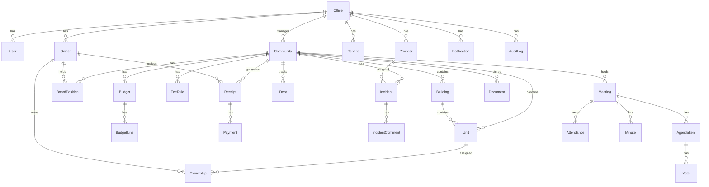

# COMUNET — Modelo de Datos

## Diagrama de Relaciones

## Entidades Principales

### Office (Despacho)
Tenant principal del sistema. Cada despacho gestiona múltiples comunidades.

### User (Usuario)
Pertenece a un Office. Puede estar vinculado a un Owner o Provider para los portales.

### Community (Comunidad)
Comunidad de propietarios gestionada por un Office.

### Building (Edificio/Portal)
Agrupación dentro de una comunidad.

### Unit (Unidad/Piso)
Unidad funcional (piso, local, garaje, trastero).

### Owner (Propietario)
Propietario vinculado a unidades a través de Ownership.

### Tenant (Inquilino)
Inquilino registrado en el sistema.

### Ownership (Titularidad)
Relación propietario-unidad con porcentaje y fechas.

### BoardPosition (Cargo de Junta)
Cargo activo de un propietario en una comunidad (presidente, secretario, etc.).

### Provider (Proveedor)
Empresa o profesional externo.

## Entidades Financieras

### Budget / BudgetLine
Presupuesto anual y sus líneas.

### FeeRule
Regla de cuota para generación de recibos.

### Receipt
Recibo emitido a un propietario/unidad.

### Payment
Pago registrado contra un recibo.

### Debt
Deuda pendiente por propietario/unidad.

## Entidades Operativas

### Incident / IncidentComment
Incidencia con historial de comentarios.

### Meeting / AgendaItem / Attendance / Vote / Minute
Reunión con orden del día, asistencia, votaciones y acta.

### Document
Documento almacenado por comunidad.

### Notification
Notificación in-app.

### AuditLog
Registro de auditoría de acciones.

## Enums

| Enum | Valores |
|------|---------|
| UserRole | SUPERADMIN, OFFICE_ADMIN, MANAGER, ACCOUNTANT, PRESIDENT, OWNER, PROVIDER, VIEWER |
| UserStatus | ACTIVE, INACTIVE, SUSPENDED |
| UnitType | APARTMENT, COMMERCIAL, GARAGE, STORAGE, OTHER |
| BudgetStatus | DRAFT, APPROVED, CLOSED |
| FeeFrequency | MONTHLY, QUARTERLY, SEMIANNUAL, ANNUAL |
| ReceiptStatus | DRAFT, ISSUED, PARTIALLY_PAID, PAID, OVERDUE, RETURNED, CANCELLED |
| PaymentMethod | BANK_TRANSFER, DIRECT_DEBIT, CASH, CHECK, OTHER |
| DebtStatus | PENDING, PARTIALLY_PAID, PAID, WRITTEN_OFF |
| IncidentPriority | LOW, MEDIUM, HIGH, URGENT |
| IncidentStatus | OPEN, ASSIGNED, IN_PROGRESS, WAITING_VENDOR, RESOLVED, CLOSED |
| CommentVisibility | PUBLIC, INTERNAL |
| MeetingType | ORDINARY, EXTRAORDINARY |
| MeetingStatus | DRAFT, SCHEDULED, HELD, CLOSED |
| MinuteStatus | DRAFT, GENERATED, APPROVED |
| AttendanceType | IN_PERSON, DELEGATED, REMOTE |
| VoteValue | FOR, AGAINST, ABSTAIN |
| DocumentVisibility | INTERNAL, OWNERS, PUBLIC |
| NotificationChannel | IN_APP, EMAIL |
| NotificationStatus | PENDING, SENT, READ, FAILED |
| AuditAction | CREATE, UPDATE, DELETE, ARCHIVE, STATUS_CHANGE, LOGIN, LOGOUT |

## Reglas de Datos

- Todos los importes y porcentajes usan `Decimal`.
- Soft-delete con `archivedAt` en: Office, User, Owner, Tenant, Provider, Document.
- `officeId` presente directa o indirectamente en toda entidad.
- Índices en campos de filtro frecuente (status, officeId, communityId).
- Unique constraints: User.email, Office.slug, Receipt.reference.
