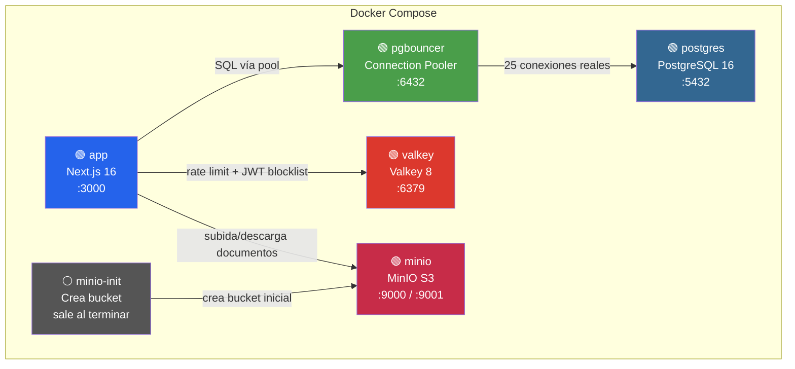

# Infraestructura Docker — COMUNET

Documento de referencia sobre cada servicio en el stack de producción de COMUNET.

> Comando para levantar todo: `docker compose -f docker-compose.production.yml up -d --build`

---

## Diagrama de Arquitectura



---

## 1. `app` — Aplicación COMUNET

| | |
|---|---|
| **Imagen** | `comunet-app` (build local desde `Dockerfile`) |
| **Puerto** | `3000` |
| **Memoria** | ~94 MB |
| **Reinicio** | Automático |

### Qué es
El servidor principal de COMUNET. Una aplicación **Next.js 16** compilada en modo standalone que sirve tanto el backoffice (gestión de comunidades, propietarios, finanzas, incidencias) como el portal de propietarios.

### Qué hace en el proyecto
- Sirve la **interfaz web** (SSR + React)
- Ejecuta la **lógica de negocio** (server actions, API routes)
- Gestiona la **autenticación** (JWT con blocklist en Valkey)
- Aplica **rate limiting** a login y API
- Envía **emails** transaccionales vía Resend
- Al arrancar, ejecuta `prisma migrate deploy` para aplicar migraciones pendientes automáticamente

### Depende de
PgBouncer (base de datos), Valkey (caché), MinIO (almacenamiento)

---

## 2. `postgres` — Base de Datos

| | |
|---|---|
| **Imagen** | `postgres:16-alpine` |
| **Puerto** | `5432` |
| **Memoria** | ~42 MB |
| **Volumen** | `comunet_pgdata` (persistente) |

### Qué es
**PostgreSQL 16** — la base de datos relacional donde vive toda la información de COMUNET.

### Qué almacena
- Usuarios, roles y permisos
- Comunidades, propietarios, unidades (pisos)
- Recibos, reglas de cuotas, contabilidad
- Incidencias y proveedores
- Actas de juntas y documentos adjuntos
- Inquilinos y cargos de junta directiva
- Audit log (registro de cambios)

### Configuración de rendimiento
| Parámetro | Valor | Para qué sirve |
|-----------|-------|-----------------|
| `max_connections` | 200 | Conexiones máximas (PgBouncer gestiona el pool) |
| `shared_buffers` | 256 MB | Caché de datos en memoria de PostgreSQL |
| `effective_cache_size` | 768 MB | Le dice al planificador cuánta RAM hay disponible |
| `work_mem` | 4 MB | Memoria por operación de ordenación/hash |
| `log_min_duration_statement` | 500 ms | Loguea queries que tarden más de medio segundo |

### Healthcheck
`pg_isready -U comunet` cada 10 segundos.

---

## 3. `pgbouncer` — Connection Pooler

| | |
|---|---|
| **Imagen** | `edoburu/pgbouncer:latest` |
| **Puerto** | `6432` → `5432` interno |
| **Memoria** | ~2 MB |

### Qué es
Un **proxy de conexiones** que se sienta entre la app y PostgreSQL. Sin él, cada request de Next.js abriría una conexión nueva a Postgres, saturando el límite rápidamente.

### Qué hace en el proyecto
- La app se conecta a PgBouncer en el puerto `6432`
- PgBouncer mantiene un **pool de 25 conexiones reales** a PostgreSQL
- Acepta hasta **500 conexiones de clientes** simultáneas
- Modo **`transaction`**: reutiliza conexiones entre transacciones (óptimo para Next.js)

### Por qué es necesario
Next.js crea muchas conexiones efímeras (una por cada server action, API route, SSR). Sin pool, Postgres se queda sin conexiones en segundos bajo carga.

### Depende de
PostgreSQL (espera a que esté healthy antes de arrancar).

---

## 4. `valkey` — Caché y Blocklist

| | |
|---|---|
| **Imagen** | `valkey/valkey:8-alpine` |
| **Puerto** | `6379` |
| **Memoria** | ~5 MB (máx 128 MB configurado) |
| **Volumen** | `comunet_valkey` (persistente) |

### Qué es
**Valkey** es un fork open-source de Redis mantenido por la Linux Foundation. 100% compatible con Redis — mismos comandos, mismo protocolo, pero con licencia libre.

### Qué hace en el proyecto

| Función | Clave de ejemplo | Propósito |
|---------|-------------------|-----------|
| **JWT Blocklist** | `comunet:prod:v1:jwt:bl:{jti}` | Cuando haces logout, el token se revoca aquí. Cada request verifica si el token está bloqueado. |
| **Rate Limiting** | `comunet:prod:v1:rl:login:{ip}` | Limita intentos de login (5/min), peticiones API (100/min) y exports (5/min). |
| **KV genérico** | `comunet:prod:v1:*` | Base para cachear cualquier dato en el futuro. |

### Configuración
| Parámetro | Valor | Para qué |
|-----------|-------|----------|
| `appendonly yes` | Persistencia AOF | Escribe operaciones a disco → la blocklist sobrevive a reinicios |
| `appendfsync everysec` | Cada segundo | Buen equilibrio entre rendimiento y durabilidad |
| `maxmemory 128mb` | Límite de RAM | Suficiente para miles de tokens y contadores |
| `maxmemory-policy noeviction` | Sin expulsión | Si la memoria se llena, nuevas escrituras fallan pero las entradas existentes de blocklist se preservan. Crítico: `allkeys-lru` podría expulsar claves `jwt:bl:{jti}` y hacer que tokens revocados vuelvan a ser válidos |

### Configuración en `.env`
```env
CACHE_DRIVER="redis"
REDIS_URL="redis://valkey:6379"
```

---

## 5. `minio` — Almacenamiento de Documentos

| | |
|---|---|
| **Imagen** | `minio/minio:latest` |
| **Puerto API** | `9000` |
| **Puerto Consola** | `9001` |
| **Memoria** | ~76 MB |
| **Volumen** | `comunet_minio` (persistente) |

### Qué es
**MinIO** es un servidor de almacenamiento de objetos compatible con la API de Amazon S3. Permite almacenar archivos sin depender de servicios cloud.

### Qué almacena en el proyecto
- **Documentos de comunidades** (actas, presupuestos, contratos)
- **Adjuntos de incidencias** (fotos, informes)
- **Facturas y recibos** exportados
- Cualquier archivo que suba un usuario

### Cómo se usa
- Bucket: `comunet-documents`
- La app sube archivos vía SDK de S3 (`@aws-sdk/client-s3`)
- Las descargas se hacen con URLs pre-firmadas (seguras, temporales)

### Consola web
Accesible en `http://localhost:9001` para gestionar archivos visualmente.

### Es reemplazable
Si migras a AWS S3 o Cloudflare R2, solo cambias las variables de entorno — el código no cambia.

---

## 6. `minio-init` — Inicialización del Bucket

| | |
|---|---|
| **Imagen** | `minio/mc:latest` |
| **Memoria** | ~0 MB (sale al terminar) |
| **Tipo** | Contenedor efímero (one-shot) |

### Qué es
Un contenedor que **solo se ejecuta una vez** al levantar el stack. Usa el cliente CLI de MinIO (`mc`) para:

1. Esperar 5 segundos a que MinIO arranque
2. Crear el bucket `comunet-documents` si no existe
3. Salir

No consume recursos después de ejecutarse — aparece como ⚪ (detenido) en Docker Desktop.

---

## Resumen Visual

```
┌─────────────────────────────────────────────────────────┐
│                    COMUNET Stack                        │
├─────────────┬────────┬──────────────────────────────────┤
│ Contenedor  │ Puerto │ Rol                              │
├─────────────┼────────┼──────────────────────────────────┤
│ app         │  3000  │ Web app (Next.js SSR + API)      │
│ pgbouncer   │  6432  │ Pool de conexiones a PostgreSQL  │
│ postgres    │  5432  │ Base de datos (toda la info)      │
│ valkey      │  6379  │ Caché, rate limit, JWT blocklist  │
│ minio       │  9000  │ Almacenamiento de documentos     │
│             │  9001  │ Consola web de MinIO              │
│ minio-init  │   —    │ Crea bucket (ejecuta y sale)      │
└─────────────┴────────┴──────────────────────────────────┘
```

## Volúmenes Persistentes

Los datos sobreviven a `docker compose down` y reinicios:

| Volumen | Contenido | Tamaño típico |
|---------|-----------|---------------|
| `comunet_pgdata` | Base de datos PostgreSQL completa | Crece con los datos |
| `comunet_valkey` | AOF de Valkey (tokens revocados, contadores) | < 10 MB |
| `comunet_minio` | Todos los documentos subidos | Crece con los archivos |

> [!WARNING]
> `docker compose down -v` **borra todos los volúmenes**. Nunca uses `-v` en producción.

## Consumo Total

Basado en la captura actual del stack:

| Recurso | Uso |
|---------|-----|
| **RAM total** | ~220 MB |
| **CPU** | ~0.1% en reposo |
| **Contenedores activos** | 5 (+ 1 efímero) |
